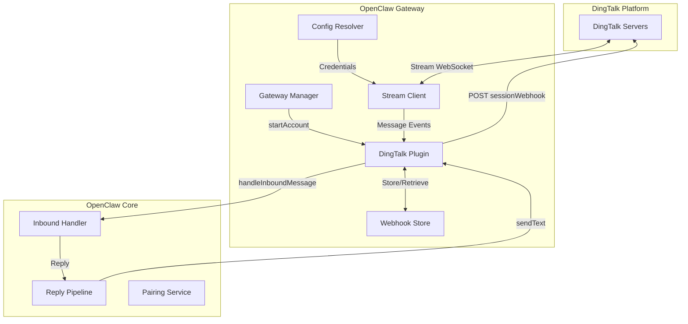

# Design Document: DingTalk Channel Plugin

## Overview

The DingTalk Channel Plugin integrates OpenClaw with DingTalk (钉钉) enterprise messaging platform using the Stream mode. This design leverages the official `dingtalk-stream` npm package to establish a persistent WebSocket connection for real-time message reception, and uses DingTalk's sessionWebhook mechanism for message replies.

The plugin follows OpenClaw's ChannelPlugin architecture, implementing the standard interfaces for configuration, security, outbound messaging, status reporting, and gateway lifecycle management.

## Architecture



### Key Design Decisions

1. **Stream Mode over HTTP Webhook**: DingTalk supports both HTTP webhook and Stream modes. Stream mode is chosen because:
   - No need to expose a public HTTP endpoint
   - Real-time message delivery via WebSocket
   - Simpler deployment (no reverse proxy/tunnel required)

2. **SessionWebhook for Replies**: DingTalk provides a temporary sessionWebhook URL with each incoming message. This webhook is valid for ~2 hours and must be used for replies. The plugin stores these webhooks keyed by conversationId.

3. **Dynamic Module Import**: The `dingtalk-stream` package is imported dynamically to allow graceful degradation if not installed.

## Components and Interfaces

### 1. Plugin Entry Point (`index.ts`)

```typescript
interface DingtalkPlugin {
  id: "dingtalk";
  name: string;
  description: string;
  configSchema: PluginConfigSchema;
  register(api: OpenClawPluginApi): void;
}
```

Responsibilities:
- Register the channel plugin with OpenClaw
- Initialize the runtime reference for cross-module access

### 2. Configuration Module (`config.ts`)

```typescript
interface DingtalkAccountConfig {
  enabled?: boolean;
  name?: string;
  appKey?: string;
  appSecret?: string;
  allowFrom?: string[];
  dmPolicy?: "open" | "pairing" | "closed";
  groupPolicy?: "open" | "allowlist" | "closed";
  groupAllowFrom?: string[];
  groups?: Record<string, { requireMention?: boolean }>;
}

interface DingtalkChannelConfig {
  enabled?: boolean;
  appKey?: string;
  appSecret?: string;
  // ... top-level defaults
  accounts?: Record<string, DingtalkAccountConfig>;
}

interface ResolvedDingtalkAccount {
  accountId: string;
  name?: string;
  enabled: boolean;
  appKey?: string;
  appSecret?: string;
  appKeySource: "config" | "env" | "none";
  config: DingtalkAccountConfig;
}
```

Functions:
- `getDingtalkChannelConfig(cfg)`: Extract dingtalk config from OpenClaw config
- `listDingtalkAccountIds(cfg)`: List all configured account IDs
- `resolveDingtalkAccount(cfg, accountId)`: Resolve full account configuration with env fallbacks

### 3. Stream Client Module (`stream.ts`)

```typescript
interface StreamMonitorParams {
  appKey: string;
  appSecret: string;
  accountId: string;
  config: OpenClawConfig;
  runtime: PluginRuntime;
  abortSignal?: AbortSignal;
  statusSink: (patch: Record<string, unknown>) => void;
  onMessage: (message: DingtalkMessage) => Promise<void>;
}

interface StreamConnection {
  stop: () => Promise<void>;
}
```

Responsibilities:
- Initialize `dingtalk-stream` DWClient
- Register callback for `/v1.0/im/bot/messages/get` topic
- Handle connection lifecycle (start, stop, reconnect)
- Report status changes via statusSink

### 4. Client Module (`client.ts`)

```typescript
interface DingtalkMessage {
  conversationId: string;
  msgId: string;
  senderId: string;
  senderNick: string;
  conversationType: "1" | "2"; // 1=DM, 2=Group
  text: { content: string };
  sessionWebhook: string;
  sessionWebhookExpiredTime: number;
  isInAtList?: boolean;
  // ... other fields
}

interface DingtalkSendResult {
  ok: boolean;
  messageId?: string;
  error?: string;
}
```

Functions:
- `replyMessage(sessionWebhook, text)`: Send text reply via webhook
- `replyMarkdown(sessionWebhook, title, text)`: Send markdown reply (future)

### 5. Channel Plugin (`channel.ts`)

Implements the `ChannelPlugin<ResolvedDingtalkAccount>` interface:

```typescript
const dingtalkPlugin: ChannelPlugin<ResolvedDingtalkAccount> = {
  id: "dingtalk",
  meta: { /* channel metadata */ },
  capabilities: { chatTypes: ["direct", "group"], media: false },
  reload: { configPrefixes: ["channels.dingtalk"] },
  config: { /* account resolution methods */ },
  security: { /* DM policy resolution */ },
  groups: { /* mention requirement resolution */ },
  outbound: { /* message sending methods */ },
  status: { /* status reporting methods */ },
  gateway: { /* account lifecycle methods */ },
};
```

### 6. Session Webhook Store

A simple in-memory Map storing webhooks with expiration:

```typescript
const sessionWebhooks = new Map<string, {
  webhook: string;
  expiresAt: number;
}>();
```

Operations:
- `storeSessionWebhook(conversationId, webhook, expiresAt)`: Store webhook
- `getSessionWebhook(conversationId)`: Retrieve if not expired

## Data Models

### Inbound Message Context

When forwarding to OpenClaw's inbound handler:

```typescript
interface InboundContext {
  channel: "dingtalk";
  accountId: string;
  senderId: string;
  chatType: "direct" | "group";
  chatId: string;
  text: string;
  reply: (text: string) => Promise<void>;
}
```

### Status Snapshot

```typescript
interface DingtalkAccountSnapshot {
  accountId: string;
  name?: string;
  enabled: boolean;
  configured: boolean;
  appKeySource: "config" | "env" | "none";
  running: boolean;
  connected: boolean;
  lastConnectedAt: number | null;
  lastError: string | null;
  lastInboundAt: number | null;
  lastOutboundAt: number | null;
}
```

### Configuration Schema

```yaml
channels:
  dingtalk:
    enabled: true
    appKey: "dingxxxxxxxx"
    appSecret: "secret"
    dmPolicy: "open" | "pairing" | "closed"
    allowFrom: ["userId1", "userId2"]
    groups:
      "*":
        requireMention: true
      "specificGroupId":
        requireMention: false
    accounts:
      work:
        enabled: true
        appKey: "work-key"
        appSecret: "work-secret"
```


## Correctness Properties

*A property is a characteristic or behavior that should hold true across all valid executions of a system—essentially, a formal statement about what the system should do. Properties serve as the bridge between human-readable specifications and machine-verifiable correctness guarantees.*

### Property 1: Connection Establishment with Credentials

*For any* valid appKey and appSecret pair, when startStreamMonitor is called, the DWClient SHALL be instantiated with clientId set to appKey and clientSecret set to appSecret.

**Validates: Requirements 1.1**

### Property 2: Callback Registration for Message Topic

*For any* successful Stream connection, the registerCallbackListener method SHALL be called with the path `/v1.0/im/bot/messages/get`.

**Validates: Requirements 1.2**

### Property 3: Graceful Disconnection

*For any* running Stream connection, when stop() is called, the disconnect method SHALL be invoked on the DWClient.

**Validates: Requirements 1.4**

### Property 4: Status Updates on State Changes

*For any* connection state change (connected, disconnected, error), the statusSink callback SHALL be invoked with the appropriate status fields (running, connected, lastConnectedAt, lastError).

**Validates: Requirements 1.5**

### Property 5: Message Parsing Completeness

*For any* valid DingTalk message JSON, the parsed DingtalkMessage object SHALL contain conversationId, senderId, senderNick, text.content, and conversationType fields extracted correctly.

**Validates: Requirements 2.1**

### Property 6: Mention Filtering for Group Messages

*For any* group message (conversationType="2") where isInAtList is false AND requireMention is true for that group, the message SHALL NOT be forwarded to the inbound handler.

**Validates: Requirements 2.2, 2.3**

### Property 7: SessionWebhook Storage Round-Trip

*For any* message with a sessionWebhook and sessionWebhookExpiredTime, storing the webhook and then retrieving it before expiration SHALL return the same webhook URL.

**Validates: Requirements 2.4, 3.1**

### Property 8: Message Forwarding Context

*For any* processed message, handleInboundMessage SHALL be called with channel="dingtalk", the correct accountId, senderId, chatType (direct or group), chatId, and text content.

**Validates: Requirements 2.5**

### Property 9: Webhook Expiration Handling

*For any* stored sessionWebhook, if the current time exceeds sessionWebhookExpiredTime, getSessionWebhook SHALL return undefined.

**Validates: Requirements 3.2**

### Property 10: Reply Message Format

*For any* text reply sent via replyMessage, the POST body SHALL contain msgtype="text" and text.content set to the reply text.

**Validates: Requirements 3.3**

### Property 11: API Error Propagation

*For any* DingTalk API response with errcode !== 0, the DingtalkSendResult SHALL have ok=false and error containing the errcode and errmsg.

**Validates: Requirements 3.4**

### Property 12: Credential Resolution Precedence

*For any* configuration where both config appKey and DINGTALK_APP_KEY environment variable are set, resolveDingtalkAccount SHALL return the config value and appKeySource="config".

**Validates: Requirements 4.1, 4.2, 4.3**

### Property 13: Multi-Account Listing

*For any* configuration with accounts defined under channels.dingtalk.accounts, listDingtalkAccountIds SHALL return all account keys from that object.

**Validates: Requirements 4.4**

### Property 14: Default Account Fallback

*For any* configuration with top-level appKey but no accounts object, listDingtalkAccountIds SHALL return ["default"].

**Validates: Requirements 4.5**

### Property 15: AllowFrom Access Control

*For any* DM message where dmPolicy is "pairing" or "closed", if the senderId is in the allowFrom list, the message SHALL be processed; otherwise it SHALL be blocked.

**Validates: Requirements 5.2, 5.3**

### Property 16: Per-Group RequireMention Resolution

*For any* group ID, resolveRequireMention SHALL return the value from groups[groupId].requireMention if defined, otherwise groups["*"].requireMention, otherwise true.

**Validates: Requirements 5.4**

### Property 17: Status Snapshot Completeness

*For any* account, buildAccountSnapshot SHALL return an object containing accountId, name, enabled, configured, appKeySource, running, connected, lastConnectedAt, lastError, lastInboundAt, and lastOutboundAt fields.

**Validates: Requirements 6.1, 6.2, 6.3, 6.4, 6.5**

## Error Handling

### Connection Errors

1. **Module Not Found**: If `dingtalk-stream` cannot be imported, log error and set status to `{ running: false, lastError: "dingtalk-stream 模块未安装" }`.

2. **Authentication Failure**: If DWClient.start() throws, catch the error, set status to `{ running: false, connected: false, lastError: String(error) }`, and re-throw.

3. **Connection Lost**: The dingtalk-stream SDK handles reconnection internally. Status updates should reflect disconnection events.

### Message Handling Errors

1. **Parse Error**: If message JSON parsing fails, return `{ status: "LATER" }` to DingTalk for retry.

2. **Handler Error**: If onMessage callback throws, log the error and attempt to send an error reply to the user.

3. **Reply Error**: If sessionWebhook POST fails, return `{ ok: false, error: String(error) }`.

### Configuration Errors

1. **Missing Credentials**: If appKey or appSecret is missing, set status to `{ running: false, lastError: "缺少 appKey 或 appSecret" }` and return early.

2. **Invalid Account**: If requested accountId doesn't exist, return a ResolvedDingtalkAccount with enabled=false and appKeySource="none".

## Testing Strategy

### Unit Tests

Unit tests should cover:
- Configuration resolution logic (config.ts)
- SessionWebhook storage and expiration (channel.ts)
- Message parsing and context building
- Error handling paths

### Property-Based Tests

Property-based tests using a library like `fast-check` should verify:
- **Property 5**: Message parsing with randomly generated valid DingTalk message payloads
- **Property 7**: SessionWebhook round-trip with random webhook URLs and expiration times
- **Property 12**: Credential resolution with random combinations of config and env values
- **Property 13/14**: Account listing with random account configurations
- **Property 16**: RequireMention resolution with random group configurations

Each property test should run a minimum of 100 iterations.

### Integration Tests

Integration tests (manual or with mocked DingTalk servers) should verify:
- Full message flow from reception to reply
- Multi-account switching
- Reconnection behavior

### Test Configuration

```typescript
// Property test example tag format
// Feature: dingtalk-channel-plugin, Property 7: SessionWebhook round-trip
```
